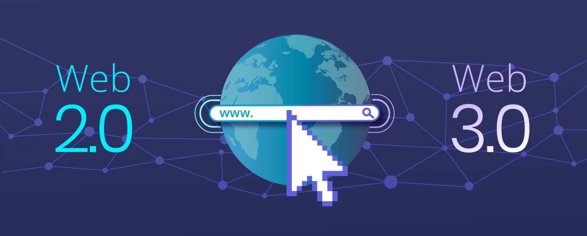

[<h1 align="">](https://github.com/ashinkuniyil)

 </h1>
 
Hi there 👋

I am Ashin, An enthusiastic professional with 8 years of rich experience in creating Web-based Applications.

## 💼 Skills

## 📌 Pinned Repositories

 
 

## &#x1f4c8; GitHub Stats

 
 
